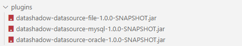
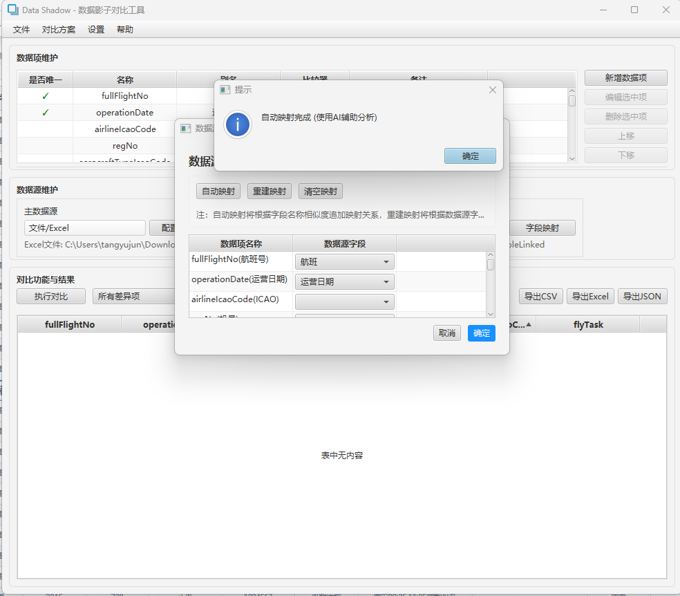

# DataShadow

DataShadow is a JavaFX-based data comparison tool that supports structured data reading, comparison and result display from multiple data sources. It is mainly used for data migration, data validation, data consistency checking and other scenarios.

## Navigation
- [中文](README.md)
- [User Guide](docs/使用说明.md)
- [Plugin Development](docs/插件开发.md)

## Main Features

- 🔌 Plugin Architecture
  - Develop data source plugins based on SDK 
  - Support dynamic loading of data source plugins
  - Provide standard data source interface specifications
  - Support import/export of comparison schemes

- 📊 Multiple Data Source Support
  - Database: MySQL, Oracle etc.
  - Files: Excel, CSV, JSON, XML
  - Support data source field mapping configuration

- 🤖 AI Assistant
  - Based on SiliconFlow's free models
  - Intelligent field mapping recommendations
  - Automatic data type recognition
  - Data format conversion suggestions

- 🔧 Flexible Configuration
  - Field Mapping: Support mapping between different data sources
  - Data Conversion: Built-in type conversion and formatting
  - Custom Comparators: Customizable comparison rules
    - Built-in Comparators: Support numeric, string, date and other basic type comparisons
    - Custom Implementation: Custom comparison logic through DataComparator interface
    - Fault Tolerance: Support setting error ranges, case insensitive options, etc.

- 📈 Intuitive Result Display
  - Difference highlighting
  - Support multiple filter modes (All/Differences/Primary/Shadow)
  - Support switching between field names and aliases
  - Support CSV/Excel/JSON format export
  - Detailed comparison result reports

## Project Progress

✅ Completed:
- Basic framework and JavaFX interface
- Plugin-based data source loading mechanism
- Data source SDK interface design
- Basic UI layout and navigation
- Data item management (CRUD, sorting, comparators)
- Comparison result display and export
- Comparison scheme import/export
- Basic file data source support (CSV/XML)
- AI assistant integration

⏳ In Development:
- Database data source enhancement (MySQL/Oracle)
- More file format support (Excel/JSON)
- Data source field mapping optimization
- Comparison performance optimization
- More comparator types support
- Q&A documentation improvement

## Screenshots

## Build Instructions (Windows)

1. Ensure JDK 21 or higher is installed
2. Set JAVA_HOME environment variable to point to your JDK installation directory
   - Example: `set JAVA_HOME=C:\Program Files\Java\jdk-21`
3. Set JAVAFX_HOME environment variable to point to your JavaFX SDK installation directory
   - Example: `set JAVAFX_HOME=C:\Path\To\javafx-sdk-21.0.2`
   - JavaFX SDK can be downloaded from [official website](https://gluonhq.com/products/javafx/)
4. Run `build.bat` script in the project root directory and wait for build completion
5. After build completes, navigate to `dist/datashadow` directory
6. Run `run.bat` script to launch DataShadow

Note: Currently only Windows build scripts are provided. Build support for other platforms is under development.

## Tech Stack

- Java 21
- JavaFX 21.0.2
- Maven
- JUnit 5
- Main Dependencies:
  - Apache POI
  - FastJSON
  - Apache Commons CSV
  - MySQL/Oracle JDBC
