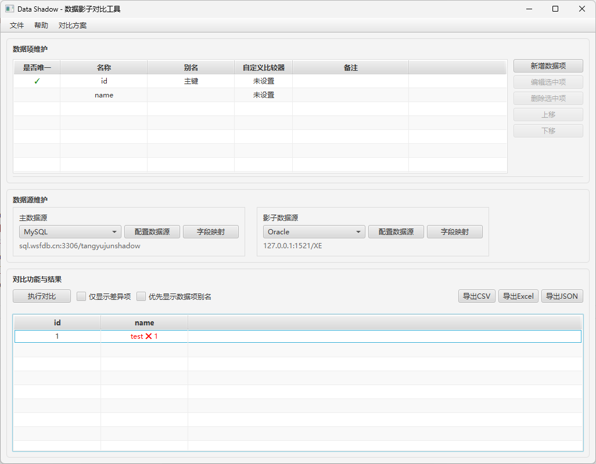
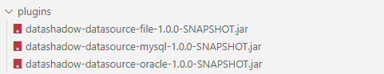

# DataShadow

DataShadow是一个基于JavaFX的数据比对工具,支持多种数据源的结构化数据读取、比对和结果展示。主要用于数据迁移、数据校验、数据一致性检查等场景。

## 主要特性

- 🔌 插件化架构
  - 基于SDK开发数据源插件
  - 支持动态加载数据源
  - 提供标准接口规范

- 📊 多种数据源支持 
  - 数据库: MySQL、Oracle等
  - 文件: Excel、CSV、JSON、XML
  - 内存数据: 支持直接输入比对

- 🔧 灵活的配置
  - 字段映射: 支持不同数据源字段映射
  - 数据转换: 内置类型转换和格式化
  - 自定义比较器: 可自定义比对规则
  - JavaScript脚本: 支持使用JS编写自定义数据项比对逻辑

- 📈 直观的结果展示
  - 差异高亮显示
  - 多种导出格式
  - 详细比对报告

## 项目进度

✅ 已完成:
- 基础框架与JavaFX界面
- 数据项管理(增删改查、排序、比较器)
- 内存数据源(JSON/XML/CSV导入、预览)
- 插件加载机制

⏳ 开发中:
- 数据库数据源(MySQL/Oracle)
- 文件数据源(Excel/CSV/JSON/XML)
- 数据比对功能
- 结果导出功能

## 截图

## 技术栈

- Java 23
- JavaFX 21.0.2 
- Maven
- JUnit 5
- 主要依赖:
  - Apache POI
  - FastJSON 
  - Apache Commons CSV
  - MySQL/Oracle JDBC
