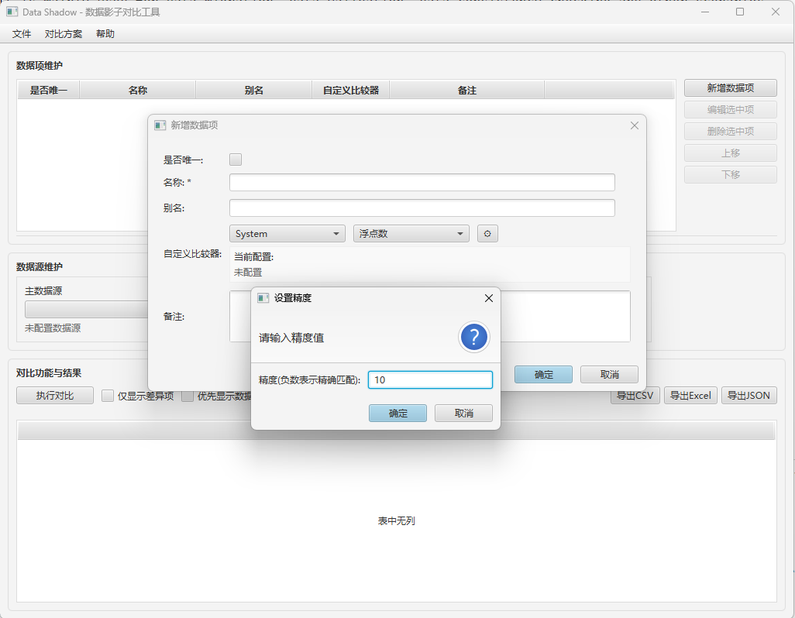

# DataShadow

DataShadow是一个基于JavaFX的数据比对工具,支持多种数据源的结构化数据读取、比对和结果展示。主要用于数据迁移、数据校验、数据一致性检查等场景。

## 导航
- [English](README_en.md)
- [使用说明](docs/使用说明.md)
- [插件开发](docs/插件开发.md)

## 主要特性

- 🔌 插件化架构
  - 基于SDK开发数据源插件
  - 支持动态加载数据源插件
  - 提供标准数据源接口规范
  - 支持对比方案的导入导出

- 📊 多种数据源支持 
  - 数据库: MySQL、Oracle等
  - 文件: Excel、CSV、JSON、XML
  - 支持数据源字段映射配置

- 🔧 灵活的配置
  - 字段映射: 支持不同数据源字段映射
  - 数据转换: 内置类型转换和格式化
  - 自定义比较器: 可自定义比对规则
    - 内置比较器: 支持数值、字符串、日期等基础类型比对
    - 自定义实现: 可通过实现DataComparator接口自定义比对逻辑
    - 容错处理: 支持设置误差范围、忽略大小写等比对选项

- 📈 直观的结果展示
  - 差异高亮显示
  - 支持多种过滤模式(全部/仅差异/主数据源/影子数据源)
  - 支持数据项名称/别名切换显示
  - 支持CSV/Excel/JSON格式导出
  - 详细的比对结果报告

## 项目进度

✅ 已完成:
- 基础框架与JavaFX界面
- 插件化数据源加载机制
- 数据源SDK接口设计
- 基础UI布局和导航
- 数据项管理(增删改查、排序、比较器)
- 对比结果展示与导出
- 对比方案导入导出
- 文件数据源基础支持(CSV/XML)

⏳ 开发中:
- 数据库数据源完善(MySQL/Oracle)
- 更多文件格式支持(Excel/JSON)
- 数据源字段映射配置优化
- 比对性能优化
- 更多比较器类型支持
- Q&A帮助文档完善

## 截图

## 技术栈

- Java 21
- JavaFX 21.0.2 
- Maven
- JUnit 5
- 主要依赖:
  - Apache POI
  - FastJSON 
  - Apache Commons CSV
  - MySQL/Oracle JDBC
