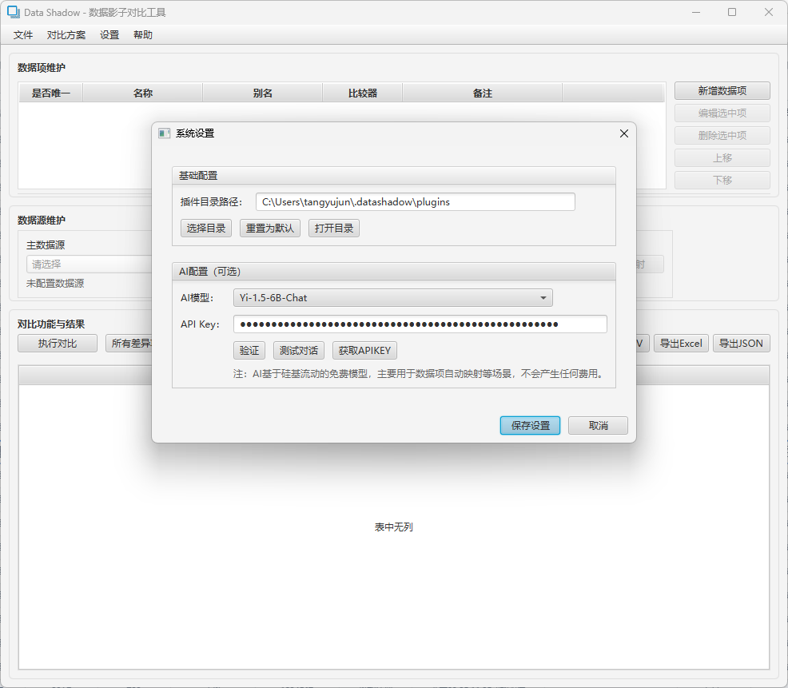

# DataShadow

DataShadow是一个基于JavaFX的数据比对工具,支持多种数据源的结构化数据读取、比对和结果展示。主要用于数据迁移、数据校验、数据一致性检查等场景。

## 导航
- [English](README_en.md)
- [使用说明](docs/使用说明.md)
- [自行构建](docs/自行构建.md)
- [插件开发](docs/插件开发.md)

## 主要特性

- 🔌 插件化架构
  - 基于SDK开发数据源插件
  - 支持动态加载数据源插件
  - 提供标准数据源接口规范
  - 支持对比方案的导入导出

- 📊 多种数据源支持 
  - 数据库: MySQL、Oracle等
  - 文件: Excel、CSV、JSON、XML
  - HTTP: 从网络接口读取数据
  - 支持数据源字段映射配置

- 🤖 AI智能辅助
  - 基于硅基流动免费模型
  - 智能字段映射推荐
  - 自动数据类型识别
  - 数据格式转换建议

- 🔧 灵活的配置
  - 数据项管理
    * 支持数据项的增删改查
    * 可设置数据项名称和别名
    * 支持数据项排序调整
    * 可标记唯一性字段
  - 比较器配置
    * 内置多种比较器类型
    * 支持自定义比较规则
    * 可设置容错范围
  - 数据源配置
    * 支持多种数据源类型
    * 提供字段映射功能
    * 自动验证连接可用性

- 📈 直观的结果展示
  - 差异高亮显示
  - 多种过滤模式
    * 全部数据
    * 所有差异项
    * 仅主数据源
    * 仅主数据源差异项
    * 仅影子数据源
    * 仅影子数据源差异项
  - 表头显示模式
    * 数据项名称
    * 数据项别名优先
  - 导出功能
    * 支持Excel格式
    * 支持CSV格式
    * 支持JSON格式
    * 可扩展自定义导出

## 项目进度

✅ 已完成:
- 基础框架与JavaFX界面
- 插件化数据源加载机制
- 数据源SDK接口设计
- 基础UI布局和导航
- 数据项管理(增删改查、排序、比较器)
- 对比结果展示与导出
- 对比方案导入导出
- 文件数据源基础支持(CSV/XML)
- AI辅助功能集成

⏳ 开发中:
- 数据库数据源完善(MySQL/Oracle)
- 更多文件格式支持(Excel/JSON)
- 数据源字段映射配置优化
- 比对性能优化
- 更多比较器类型支持
- Q&A帮助文档完善

## 截图

## 自行构建 (Windows)

1. 确保已安装JDK 21或更高版本
2. 设置JAVA_HOME环境变量，指向JDK安装目录
   - 例如: `set JAVA_HOME=C:\Program Files\Java\jdk-21`
3. 设置JAVAFX_HOME环境变量，指向JavaFX SDK安装目录
   - 例如: `set JAVAFX_HOME=C:\Path\To\javafx-sdk-21.0.2`
   - JavaFX SDK可从[官方网站](https://gluonhq.com/products/javafx/)下载
4. 在项目根目录下运行`build.bat`脚本，等待构建完成
5. 构建完成后，进入`dist/datashadow`目录
6. 运行`run.bat`脚本启动DataShadow

注: 目前仅提供Windows平台的构建脚本，其他平台的构建支持正在开发中。

## 技术栈

- Java 21
- JavaFX 21.0.2 
- Maven
- JUnit 5
- 主要依赖:
  - Apache POI
  - FastJSON 
  - Apache Commons CSV
  - MySQL/Oracle JDBC
